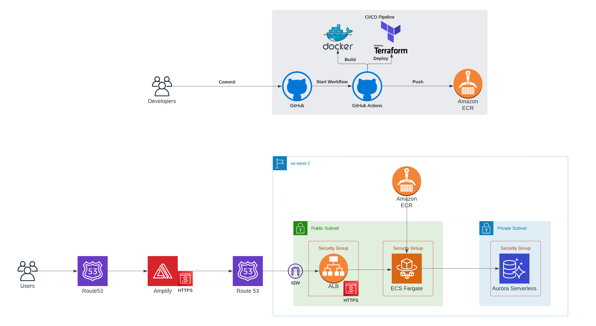

# House Party

   

House Party is a Collaborative Music Playing System and is a way for you and your friends to listen to music on Spotify together! You can access the frontend at https://houseparty.imranmatin.com and the backend at https://api.houseparty.imranmatin.com. For a demo of `House Party` and a guide for how to use it, please see [PRODUCT_DEMO.md](PRODUCT_DEMO.md).

## High Level Architecture

`House Party` is full stack web app created with React (Frontend), Django (Backend), PostgreSQL (Database), Docker (Containers), Terraform (IaC), AWS (3PC), and Github Actions (CI/CD).

  <a href="https://lucid.app/lucidchart/f793f794-16cb-4f11-a141-57211f60e8f3/edit?viewport_loc=-1317%2C-1314%2C4992%2C2442%2C0_0&invitationId=inv_6dfb9991-fb70-47f7-9ed5-fc6efa87ec8f">High Level Architecture Diagram</a>

## Environments

The following environments are available for this app.

- `local`
- ~~`dev`~~
- ~~`alpha`~~
- ~~`beta`~~
- `prod`

## Frontend

The frontend was created using the `create-react-app` CLI. See [frontend/README.md](frontend/README.md) for further details about the fronted.

## Backend

The backend was created using the `django-admin` CLI and the database was created using `PostgreSQL`. See [backend/README.md](backend/README.md) for further details about the backend.

## Infrastructure

The infrastructure was created using `docker`, `terraform` and `AWS`. See [infra/README.md](infra/README.md) for further details about the infrastructure.

## CI (Build/Test) / CD (Deploy) Pipeline

The CI/CD pipeline was created using `GitHub Actions`. See [.github/workflows/README.md](.github/workflows/README.md) for further details about the CI/CD pipeline.

## Bugs

N/A.

## Enhancements

- Add test scaffolding (unit, integration, canary, etc.) for frontend/backend.
- Read backend secrets from AWS Secrets Manager rather than from environment variables.
- Convert frontend CI/CD to use Github Actions for build, test, deploy and convert frontend Amplify to manual hosting (i.e. no Git provider connecting and no build, test, deploy in Amplify)
- Add dev/alpha/beta stages
  - Secure dev/alpha/beta/prod stages
  - Create infrastructure
  - Add CI/CD stages using only Github Actions (NOTE: GitHub Actions has a Workflow Visualizer that is the equivalent of a Pipeline Visualizer).
  - Update frontend/backend app code
